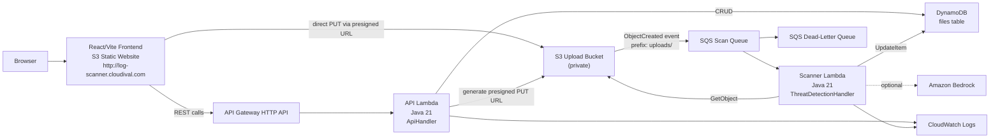

# LogScan Serverless — Technical Design

## 1. System Architecture



### Key Design Decisions

| Decision | Rationale |
|----------|-----------|
| S3 presigned PUT (browser → S3 direct) | Avoids proxying file bytes through Lambda; reduces cost and latency |
| SQS between S3 and Scanner Lambda | Decouples upload from processing; automatic retry with DLQ |
| Single DynamoDB table | Simple access pattern (PK: ownerUserId, SK: fileId); PAY_PER_REQUEST avoids capacity planning |
| One API Lambda handler | Fewer cold starts; single deployment unit; routes parsed internally |
| Mock detector by default | Works without Bedrock model access approval |
| HTTP-only frontend | S3 website hosting; no CloudFront dependency for initial deployment |

---

## 2. Project Structure

```text
log-scanner-aws-hackathon/
├── frontend/                          # React 18 + Vite 5 + React Router 6
│   ├── index.html
│   ├── package.json
│   ├── package-lock.json
│   ├── vite.config.js
│   └── src/
│       ├── main.jsx
│       ├── App.jsx
│       ├── auth.js                    # Optional Cognito PKCE helper
│       ├── api/
│       │   └── fileApi.js             # Axios/fetch wrapper for API
│       ├── components/
│       │   ├── FileUpload.jsx         # Drag-drop + progress upload
│       │   ├── FileList.jsx           # List scans with status
│       │   └── ScanResultDetail.jsx   # Threat findings display
│       └── test/
│           ├── setup.js
│           ├── FileUpload.test.jsx
│           ├── FileList.test.jsx
│           └── fileApi.test.js
├── lambda/                            # Java 21 Lambda (single Maven project)
│   ├── pom.xml
│   ├── src/main/java/com/logscan/lambda/
│   │   ├── ApiHandler.java            # API Gateway HTTP API handler
│   │   ├── ThreatDetectionHandler.java # SQS-triggered scanner
│   │   ├── detector/
│   │   │   ├── ThreatDetector.java    # Interface
│   │   │   ├── MockThreatDetector.java
│   │   │   └── BedrockThreatDetector.java
│   │   └── model/
│   │       └── ScanResult.java
│   └── src/test/java/com/logscan/lambda/detector/
│       ├── MockThreatDetectorTest.java
│       └── BedrockThreatDetectorTest.java
├── infra/terraform/                   # Terraform IaC
│   ├── versions.tf
│   ├── variables.tf
│   ├── main.tf
│   ├── outputs.tf
│   ├── terraform.tfvars.example
│   ├── deploy.sh
│   └── README.md
├── README.md
└── .gitignore
```

---

## 3. Data Model

### 3.1 DynamoDB Table: `log-threat-detection-{environment}-files`

**Billing:** PAY_PER_REQUEST  
**Encryption:** AWS-managed SSE

| Key | Attribute | Type |
|-----|-----------|------|
| PK | `ownerUserId` | String |
| SK | `fileId` | String |

**Attributes:**

| Attribute | Type | Description |
|-----------|------|-------------|
| `ownerUserId` | S | Cognito `sub` claim or `"anonymous"` |
| `fileId` | S | UUID generated by API Lambda |
| `fileName` | S | Original file name |
| `fileSize` | N | Size in bytes |
| `s3Bucket` | S | Upload bucket name |
| `s3Key` | S | Full S3 object key |
| `status` | S | `UPLOAD_PENDING` → `PENDING` → `COMPLETED` or `FAILED` |
| `uploadedAt` | S | ISO 8601 UTC |
| `updatedAt` | S | ISO 8601 UTC |
| `threatLevel` | S | `NONE` / `LOW` / `MEDIUM` / `HIGH` / `CRITICAL` |
| `summary` | S | Human-readable summary |
| `findingsJson` | S | Serialized JSON array of findings |
| `scannedAt` | S | ISO 8601 UTC |

### 3.2 Status State Machine

```text
UPLOAD_PENDING  ──(POST /api/files/{fileId}/confirm)──▶  PENDING
                                                            │
                                          ┌─────────────────┤
                                          ▼                 ▼
                                      COMPLETED          FAILED
```

- `UPLOAD_PENDING`: Metadata created, presigned URL returned, file not yet uploaded.
- `PENDING`: File confirmed uploaded, awaiting scanner.
- `COMPLETED`: Scanner finished successfully.
- `FAILED`: Scanner encountered an error (SQS retries up to 3x before DLQ).

---

## 4. API Design

### 4.1 API Gateway Configuration

- **Type:** HTTP API (payload format 2.0)
- **Stage:** `$default` (auto-deploy)
- **CORS:** Origins `http://log-scanner.cloudival.com`, `http://localhost:5173`; Methods `GET, POST, OPTIONS`; Headers `Content-Type, Authorization`
- **Auth:** `NONE` by default; JWT authorizer (Cognito) when `enable_cognito = true`

### 4.2 Endpoints

| Method | Path | Auth | Description |
|--------|------|------|-------------|
| GET | `/api/health` | None (always) | Returns `{"status":"UP"}` |
| POST | `/api/files` | Conditional | Validate metadata, create DDB item, return presigned PUT URL |
| POST | `/api/files/{fileId}/confirm` | Conditional | Transition status from UPLOAD_PENDING → PENDING |
| GET | `/api/files` | Conditional | List files for current owner, newest first |
| GET | `/api/files/{fileId}/result` | Conditional | Return scan result if COMPLETED |

### 4.3 Owner Resolution

```java
String ownerUserId;
if (event.requestContext.authorizer != null && event.requestContext.authorizer.jwt.claims.get("sub") != null) {
    ownerUserId = claims.get("sub");
} else {
    ownerUserId = "anonymous";
}
```

All data operations are scoped by `ownerUserId`.

### 4.4 Request/Response Schemas

#### POST /api/files

**Request:**
```json
{
  "fileName": "server.log",
  "fileSize": 12345
}
```

**Validation:**
- `fileName` required, non-blank
- `fileSize` between 1 and 10,485,760 bytes (10 MB)

**Response 200:**
```json
{
  "fileId": "550e8400-e29b-41d4-a716-446655440000",
  "uploadUrl": "https://bucket.s3.ap-southeast-1.amazonaws.com/uploads/anonymous/550e.../server.log?X-Amz-...",
  "expiresIn": 900
}
```

**S3 Key Format:** `uploads/{ownerUserId}/{fileId}/{safeFileName}`

**Presigned URL:** PUT, 15 min expiry, Content-Type `application/octet-stream`

#### POST /api/files/{fileId}/confirm

**Response 200:**
```json
{
  "fileId": "...",
  "fileName": "server.log",
  "fileSize": 12345,
  "status": "PENDING",
  "uploadedAt": "2026-07-04T10:00:00Z"
}
```

#### GET /api/files

**Response 200:**
```json
{
  "files": [
    {
      "fileId": "...",
      "fileName": "server.log",
      "fileSize": 12345,
      "status": "COMPLETED",
      "uploadedAt": "2026-07-04T10:00:00Z"
    }
  ]
}
```

#### GET /api/files/{fileId}/result

**Response 200 (when COMPLETED):**
```json
{
  "fileId": "...",
  "fileName": "server.log",
  "scanResult": {
    "threatLevel": "HIGH",
    "summary": "3 distinct threat patterns detected.",
    "findings": [
      {
        "keyword": "SQL injection",
        "description": "SQL injection indicator detected.",
        "lineNumber": 42,
        "lineContent": "ERROR SQL injection attempt"
      }
    ],
    "scannedAt": "2026-07-04T10:01:00Z"
  }
}
```

**Response 409:** Status is not COMPLETED  
**Response 404:** File not found for owner

---

## 5. Processing Pipeline

```text
┌─────────────────────────────────────────────────────────────┐
│ 1. Frontend: POST /api/files {fileName, fileSize}           │
│    → API Lambda validates, creates DDB item (UPLOAD_PENDING)│
│    → Returns presigned S3 PUT URL                           │
└─────────────────────────┬───────────────────────────────────┘
                          ▼
┌─────────────────────────────────────────────────────────────┐
│ 2. Frontend: PUT file → S3 presigned URL                    │
│    Content-Type: application/octet-stream                   │
│    Progress tracked via XMLHttpRequest.upload.onprogress    │
└─────────────────────────┬───────────────────────────────────┘
                          ▼
┌─────────────────────────────────────────────────────────────┐
│ 3. Frontend: POST /api/files/{fileId}/confirm               │
│    → API Lambda updates status to PENDING                   │
└─────────────────────────┬───────────────────────────────────┘
                          ▼
┌─────────────────────────────────────────────────────────────┐
│ 4. S3 ObjectCreated event (prefix uploads/) → SQS           │
└─────────────────────────┬───────────────────────────────────┘
                          ▼
┌─────────────────────────────────────────────────────────────┐
│ 5. Scanner Lambda triggered by SQS (batch size: 1)          │
│    a. Parse S3 event from SQS body                          │
│    b. Extract ownerUserId, fileId from S3 key               │
│    c. Lookup DDB item — skip if COMPLETED (idempotent)      │
│    d. Download object from S3 as UTF-8 text                 │
│    e. Run ThreatDetector.analyze(content)                   │
│    f. Update DDB: status=COMPLETED, threatLevel, summary,   │
│       findingsJson, scannedAt, updatedAt                    │
│    g. On error: status=FAILED, throw → SQS retries (max 3) │
└─────────────────────────────────────────────────────────────┘
```

---

## 6. Lambda Design

### 6.1 API Lambda (`ApiHandler`)

| Setting | Value |
|---------|-------|
| Runtime | Java 21 (`java21`) |
| Handler | `com.logscan.lambda.ApiHandler::handleRequest` |
| Memory | 512 MB |
| Timeout | 15 seconds |
| Event type | API Gateway HTTP API payload format 2.0 |

**Routing:** Parse `event.requestContext.http.method` and `event.rawPath` to determine the route. Use `event.pathParameters` to extract path variables (e.g., `fileId`). Dispatch to internal methods based on method + path combination.

```java
// Routing pseudocode
String method = event.getRequestContext().getHttp().getMethod();   // GET, POST
String path   = event.getRawPath();                                // /api/files, /api/files/{fileId}/confirm
Map<String, String> pathParams = event.getPathParameters();        // {fileId: "uuid"}
```

**Dependencies:** AWS SDK v2 (DynamoDB, S3 Presigner), Jackson.

**Environment Variables:**
```text
FILES_TABLE_NAME=log-threat-detection-dev-files
S3_BUCKET_NAME=<upload-bucket-name>
CORS_ALLOWED_ORIGINS=http://log-scanner.cloudival.com,http://localhost:5173
```

**CORS:** All responses include:
- `Access-Control-Allow-Origin` from environment variable `CORS_ALLOWED_ORIGINS` (matched against request Origin header)
- `Access-Control-Allow-Methods: GET, POST, OPTIONS`
- `Access-Control-Allow-Headers: Content-Type, Authorization`

### 6.2 Scanner Lambda (`ThreatDetectionHandler`)

| Setting | Value |
|---------|-------|
| Runtime | Java 21 (`java21`) |
| Handler | `com.logscan.lambda.ThreatDetectionHandler::handleRequest` |
| Memory | 512 MB |
| Timeout | 45 seconds |
| Trigger | SQS event source mapping (batch size: 1) |
| Function name | `log-threat-detection-{environment}-threat-detection` |

**Environment Variables:**
```text
FILES_TABLE_NAME=log-threat-detection-dev-files
S3_BUCKET_NAME=<upload-bucket-name>
DETECTOR_TYPE=MOCK
BEDROCK_MODEL_ID=anthropic.claude-3-haiku-20240307-v1:0
```

**S3 Key Parsing:**
```text
uploads/{ownerUserId}/{fileId}/{fileName}
         ↓              ↓
    partition key    sort key for DDB lookup
```

### 6.3 Threat Detector Strategy

```java
public interface ThreatDetector {
    ScanResult analyze(String logContent);
}
```

**Factory pattern:** Based on `DETECTOR_TYPE` env var:
- `MOCK` → `MockThreatDetector` (keyword-based, always available)
- `BEDROCK` → `BedrockThreatDetector` (requires model access)

### 6.4 MockThreatDetector Logic

**Keywords** (case-insensitive):
- `unauthorized access`, `sql injection`, `brute force`, `malware detected`, `privilege escalation`, `failed login`, `suspicious command`, `rm -rf`, `chmod 777`, `root login`

**Algorithm:**
1. Split content into lines.
2. For each line, check all keywords (case-insensitive contains).
3. Record finding: keyword, description, lineNumber, lineContent.
4. Cap at 50 findings.
5. Count distinct keywords found.
6. Determine threat level:
   - 0 distinct → `NONE`
   - 1 distinct → `LOW`
   - 2 distinct → `MEDIUM`
   - 3–4 distinct → `HIGH`
   - 5+ distinct → `CRITICAL`

### 6.5 BedrockThreatDetector Logic

1. Build prompt with log content asking for strict JSON output matching `ScanResult` schema.
2. Invoke Bedrock Runtime (`InvokeModel`) with configured model ID.
3. Parse JSON response into `ScanResult`.
4. On parse failure: throw RuntimeException (triggers SQS retry).

---

## 7. Frontend Design

### 7.1 Tech Stack

| Library | Purpose |
|---------|---------|
| React 18 | UI framework |
| Vite 5 | Build tool + dev server |
| React Router 6 | Client-side routing |
| Vitest + React Testing Library | Unit tests |
| Plain CSS / inline styles | Styling (dark security theme) |

### 7.2 Routes

| Route | Component | Description |
|-------|-----------|-------------|
| `/` | `FileList` | List all uploaded files with status |
| `/upload` | `FileUpload` | Drag-drop upload with progress |
| `/files/:fileId/result` | `ScanResultDetail` | Scan findings display |

### 7.3 Environment Variables

```env
VITE_API_BASE_URL=https://{api-id}.execute-api.ap-southeast-1.amazonaws.com/api
VITE_COGNITO_DOMAIN=
VITE_COGNITO_CLIENT_ID=
VITE_COGNITO_REDIRECT_URI=
VITE_COGNITO_LOGOUT_URI=
```

- If `VITE_API_BASE_URL` is empty, defaults to `/api`.
- If `VITE_COGNITO_*` are empty, auth is disabled (public mode).

### 7.4 API Client (`fileApi.js`)

```javascript
// Functions:
requestUpload(fileName, fileSize) → { fileId, uploadUrl, expiresIn }
confirmUpload(fileId) → { fileId, fileName, fileSize, status, uploadedAt }
listFiles() → { files: [...] }
getResult(fileId) → { fileId, fileName, scanResult: {...} }
```

All requests include `Authorization: Bearer <token>` when auth is enabled.

### 7.5 Upload Flow (FileUpload Component)

1. User drags/selects file.
2. Validate: 1 byte ≤ size ≤ 10 MB.
3. Call `requestUpload(fileName, fileSize)`.
4. PUT file to `uploadUrl` with `Content-Type: application/octet-stream`.
5. Track progress via `XMLHttpRequest.upload.onprogress`.
6. On S3 PUT success: call `confirmUpload(fileId)`.
7. Show success with link to file list.
8. On failure: show error with retry button.

### 7.6 Visual Design

- Dark background (`#1a1a2e` / `#16213e`).
- Status badges: green (COMPLETED/NONE), yellow (PENDING), red (FAILED/CRITICAL), orange (HIGH/MEDIUM).
- Sticky top nav with brand "LogScan" and links (Files, Upload).
- Content max-width ~1100px, centered.
- Footer: "Log Threat Detection System • Built with React, API Gateway, Lambda, S3, SQS, and DynamoDB".

### 7.7 Optional Cognito Auth (`auth.js`)

- Authorization Code + PKCE flow via Cognito Hosted UI.
- Tokens stored in `localStorage`.
- If env vars empty → auth disabled, app works as public.
- If authenticated: decode ID token for user email, show sign-out button.

---

## 8. Infrastructure (Terraform)

### 8.1 Provider & Backend

```hcl
terraform {
  required_version = ">= 1.5"
  required_providers {
    aws = { source = "hashicorp/aws", version = "~> 5.0" }
  }
}

provider "aws" {
  region = var.aws_region
  default_tags {
    tags = {
      Project     = var.project_name
      Environment = var.environment
      ManagedBy   = "terraform"
    }
  }
}
```

### 8.2 Resources Summary

| Resource | Name Pattern | Notes |
|----------|-------------|-------|
| S3 Upload Bucket | `var.upload_bucket_name` | Private, AES256, CORS for browser PUT |
| S3 Frontend Bucket | `var.frontend_domain` (when no CF) | Website hosting, public read |
| SQS Queue | `{project}-{env}-scan-queue` | Visibility timeout = scanner_lambda_timeout + 15 |
| SQS DLQ | `{project}-{env}-scan-dlq` | maxReceiveCount: 3 |
| DynamoDB Table | `{project}-{env}-files` | PAY_PER_REQUEST, SSE |
| Lambda (API) | `{project}-{env}-api` | Java 21, 512MB, 15s |
| Lambda (Scanner) | `{project}-{env}-threat-detection` | Java 21, 512MB, 45s |
| API Gateway HTTP API | `{project}-{env}-api` | $default stage |
| IAM Roles | `{project}-{env}-api-role`, `{project}-{env}-scanner-role` | Least privilege |
| CloudWatch Log Groups | `/aws/lambda/{function-name}` | 7-day retention |
| Route 53 A Record | `var.frontend_domain` | Alias to S3 website endpoint |
| S3 Notification | ObjectCreated → SQS | prefix `uploads/` |

### 8.3 Variables

```hcl
variable "aws_region"               { default = "ap-southeast-1" }
variable "environment"              { default = "dev" }
variable "project_name"             { default = "log-threat-detection" }
variable "upload_bucket_name"       { description = "Globally unique upload bucket name" }
variable "frontend_bucket_name"     { default = "" }
variable "frontend_domain"          { default = "log-scanner.cloudival.com" }
variable "route53_zone_id"          { default = "Z0047063JX9ZJQL6MINC" }
variable "enable_cloudfront"        { default = false }
variable "enable_cognito"           { default = false }
variable "cognito_domain_prefix"    { default = "" }
variable "detector_type"            { default = "MOCK" }
variable "bedrock_model_id"         { default = "anthropic.claude-3-haiku-20240307-v1:0" }
variable "lambda_memory"            { default = 512 }
variable "api_lambda_timeout"       { default = 15 }
variable "scanner_lambda_timeout"   { default = 45 }
variable "lambda_reserved_concurrency" { default = null }
variable "frontend_certificate_arn" { default = "" }
```

### 8.4 S3 Upload Bucket CORS

```hcl
cors_rule {
  allowed_headers = ["*"]
  allowed_methods = ["PUT"]
  allowed_origins = [
    "http://localhost:5173",
    "http://${var.frontend_domain}"
  ]
  max_age_seconds = 3600
}
```

### 8.5 S3 Frontend Hosting (No CloudFront)

When `enable_cloudfront = false`:
- Bucket name = `var.frontend_domain` (e.g., `log-scanner.cloudival.com`)
- Website config: index_document = `index.html`, error_document = `index.html`
- Public bucket policy for `s3:GetObject`
- Route 53 A alias record → S3 website endpoint (zone ID `Z3O0J2DXBE1FTB` for ap-southeast-1)

### 8.6 API Gateway HTTP API

```hcl
resource "aws_apigatewayv2_api" "api" {
  name          = "${var.project_name}-${var.environment}-api"
  protocol_type = "HTTP"
  cors_configuration {
    allow_origins = ["http://localhost:5173", "http://${var.frontend_domain}"]
    allow_methods = ["GET", "POST", "OPTIONS"]
    allow_headers = ["content-type", "authorization"]
  }
}
```

Routes:
```hcl
GET  /api/health
POST /api/files
POST /api/files/{fileId}/confirm
GET  /api/files
GET  /api/files/{fileId}/result
```

Authorization: `NONE` by default. When `enable_cognito = true`, attach JWT authorizer to all routes except `/api/health`.

### 8.7 IAM Policies

**API Lambda Role:**
- `logs:CreateLogGroup`, `logs:CreateLogStream`, `logs:PutLogEvents`
- `dynamodb:GetItem`, `dynamodb:PutItem`, `dynamodb:Query`, `dynamodb:UpdateItem` on files table
- `s3:PutObject` on upload bucket `uploads/*`

**Scanner Lambda Role:**
- `logs:CreateLogGroup`, `logs:CreateLogStream`, `logs:PutLogEvents`
- `s3:GetObject` on upload bucket `uploads/*`
- `dynamodb:GetItem`, `dynamodb:UpdateItem` on files table
- `sqs:ReceiveMessage`, `sqs:DeleteMessage`, `sqs:GetQueueAttributes` on scan queue
- `bedrock:InvokeModel` on `arn:aws:bedrock:*::foundation-model/*`

### 8.8 Optional Resources

#### CloudFront (when `enable_cloudfront = true`)
- Distribution with Origin Access Control (OAC)
- HTTPS via ACM certificate (`frontend_certificate_arn`)
- Route 53 A alias → CloudFront domain
- Frontend bucket becomes private (bucket policy allows only CloudFront service principal with OAC condition)

#### Cognito (when `enable_cognito = true`)
- User pool with email sign-up
- App client (Authorization Code + PKCE, no secret)
- Custom domain (`cognito_domain_prefix`)
- API Gateway JWT authorizer

### 8.9 Outputs

```hcl
output "api_url"                      { value = "${aws_apigatewayv2_api.api.api_endpoint}/api" }
output "frontend_url"                 { value = "http://${var.frontend_domain}" }
output "s3_frontend_bucket_name"      { value = aws_s3_bucket.frontend.id }
output "s3_upload_bucket_name"        { value = aws_s3_bucket.uploads.id }
output "aws_region"                   { value = var.aws_region }
output "cloudfront_distribution_id"   { value = try(aws_cloudfront_distribution.cdn[0].id, "") }
output "cognito_domain"               { value = try("https://${aws_cognito_user_pool_domain.main[0].domain}.auth.${var.aws_region}.amazoncognito.com", "") }
output "cognito_user_pool_client_id"  { value = try(aws_cognito_user_pool_client.app[0].id, "") }
```

---

## 9. Deployment Flow (`deploy.sh`)

```text
1. Check prerequisites: terraform, aws, npm, mvn
2. Verify terraform.tfvars exists
3. Build Lambda:  cd lambda && mvn clean package -DskipTests
4. Terraform:     terraform init && terraform apply
5. Read outputs:  api_url, frontend_url, s3_frontend_bucket_name, etc.
6. Build frontend with env vars injected
7. Upload:        aws s3 sync frontend/dist/ s3://$BUCKET/ --delete
8. (If CF enabled) aws cloudfront create-invalidation ...
9. Print summary: Frontend URL, API URL
```

---

## 10. Security Design

| Concern | Mitigation |
|---------|-----------|
| S3 upload bucket exposure | Block all public access; presigned URLs expire in 15 min |
| File content injection | Scanner reads as plain text; no execution |
| API input validation | Validate fileName (non-blank), fileSize (1–10MB) |
| Owner isolation | All queries scoped by ownerUserId (PK) |
| Lambda permissions | Least-privilege IAM; no `*` resource ARNs except `arn:aws:bedrock:*::foundation-model/*` for optional Bedrock invocation |
| CORS | Restricted to frontend domain + localhost |
| Secrets in git | `.gitignore` covers tfvars, .env, state, keys, credentials |
| DynamoDB encryption | SSE enabled (AWS-managed key) |
| SQS encryption | Encryption in transit (HTTPS endpoint) |

---

## 11. Testing Strategy

### 11.1 Frontend (Vitest + React Testing Library)

| Test File | Coverage |
|-----------|----------|
| `FileUpload.test.jsx` | Validation, upload progress, success/error states |
| `FileList.test.jsx` | Loading, empty, error states; status rendering |
| `fileApi.test.js` | API client success/error; auth header injection |

Command: `cd frontend && npm test -- --run`

### 11.2 Lambda (JUnit 5 + Mockito)

| Test File | Coverage |
|-----------|----------|
| `MockThreatDetectorTest.java` | Clean logs, keyword matching, threat level thresholds, max findings cap |
| `BedrockThreatDetectorTest.java` | Valid response parsing, malformed response handling, client exception |

Command: `cd lambda && mvn test`

### 11.3 Terraform Validation

```bash
cd infra/terraform
terraform fmt -check
terraform validate
```

### 11.4 Post-Deploy Verification

1. `curl $API_URL/health` → `{"status":"UP"}`
2. `curl -I http://log-scanner.cloudival.com` → `HTTP/1.1 200 OK`
3. CORS preflight check on `/api/files`
4. End-to-end: upload → confirm → wait → get result

---

## 12. Cost Model (Serverless)

| Resource | Cost at Rest | Cost per Request |
|----------|-------------|-----------------|
| Lambda | $0 | ~$0.0000002 per invocation + duration |
| API Gateway | $0 | $1.00 per million requests |
| DynamoDB (on-demand) | $0 | $1.25 per million writes, $0.25 per million reads |
| S3 | ~$0.023/GB/month stored | $0.005 per 1000 PUT |
| SQS | $0 | $0.40 per million messages |
| Route 53 | $0.50/month hosted zone | $0.40 per million queries |

**Total at rest with minimal traffic: < $1/month**
