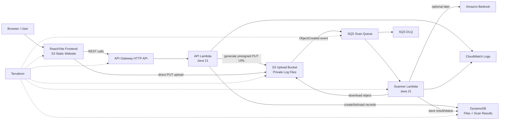

# Requirement Document: LogScan Serverless Threat Detection

## 1. Goal

Build a serverless log threat detection web application named **LogScan**.

The application must allow a user to upload a log file from a React web UI, store the file in Amazon S3, automatically scan the uploaded file asynchronously, save the scan result in DynamoDB, and show the user their uploaded files and scan results.

The final project must be functionally equivalent to the existing LogScan project:

- React/Vite frontend
- AWS API Gateway HTTP API
- Java 21 AWS Lambda API
- Java 21 AWS Lambda scanner
- S3 upload bucket for private log files
- S3 static website bucket for frontend hosting
- S3 ObjectCreated event -> SQS queue -> scanner Lambda
- DynamoDB for file metadata and scan results
- Terraform infrastructure as code
- Optional Cognito, CloudFront, and Bedrock support, but disabled by default
- Custom domain support through Route 53 and S3 website hosting over HTTP when CloudFront is disabled

This project must not use a traditional backend server, ECS, ALB, RDS, PostgreSQL, Docker deployment, or Spring Boot.

## 2. Current Deployment Constraints

The AWS account may not be verified for CloudFront and may not be authorized for Amazon Bedrock model invocation.

Therefore, the default deployment must use:

```hcl
enable_cloudfront = false
enable_cognito    = false
detector_type     = "MOCK"
```

The app must still work online without CloudFront and without Bedrock.

When CloudFront is disabled and a custom domain is configured, the frontend must be hosted as an S3 static website over HTTP:

```text
http://log-scanner.cloudival.com
```

HTTPS is not required in the default deployment because S3 website endpoints do not support HTTPS directly. HTTPS can be enabled later with CloudFront or another HTTPS-capable proxy such as Cloudflare.

## 3. Architecture



## 4. Main Flow

1. User opens the React frontend.
2. User chooses or drags a log file into the upload screen.
3. Frontend validates the file locally.
4. Frontend calls `POST /api/files`.
5. API Lambda validates metadata, creates a DynamoDB item, and returns a presigned S3 PUT URL.
6. Browser uploads the file directly to S3 using the presigned URL.
7. Frontend calls `POST /api/files/{fileId}/confirm`.
8. API Lambda changes the file status from `UPLOAD_PENDING` to `PENDING`.
9. S3 emits `ObjectCreated` event for objects under `uploads/`.
10. S3 sends that event to SQS.
11. Scanner Lambda is triggered by SQS.
12. Scanner Lambda parses the S3 event, extracts `ownerUserId` and `fileId` from the S3 key, downloads the file, scans the content, and updates DynamoDB.
13. User refreshes file list and sees `COMPLETED` or `FAILED`.
14. User opens scan detail page and sees threat level, summary, and findings.

## 5. Project Structure

The project must use this structure:

```text
frontend/
  index.html
  package.json
  package-lock.json
  vite.config.js
  src/
    main.jsx
    App.jsx
    auth.js
    api/
      fileApi.js
    components/
      FileUpload.jsx
      FileList.jsx
      ScanResultDetail.jsx
    test/
      setup.js
      FileUpload.test.jsx
      FileList.test.jsx
      fileApi.test.js

lambda/
  pom.xml
  src/main/java/com/logscan/lambda/
    ApiHandler.java
    ThreatDetectionHandler.java
    detector/
      ThreatDetector.java
      MockThreatDetector.java
      BedrockThreatDetector.java
    model/
      ScanResult.java
  src/test/java/com/logscan/lambda/detector/
    MockThreatDetectorTest.java
    BedrockThreatDetectorTest.java
  src/test/resources/mockito-extensions/
    org.mockito.plugins.MockMaker

infra/terraform/
  versions.tf
  variables.tf
  main.tf
  outputs.tf
  terraform.tfvars.example
  deploy.sh
  README.md

README.md
.gitignore
```

Do not create a `backend/` folder.

## 6. Frontend Requirements

### 6.1 Technology

- Use React 18.
- Use Vite 5.
- Use React Router 6.
- Use Vitest and React Testing Library for tests.
- Use plain CSS or component-level inline styles.
- Do not require a backend server for frontend development.
- API base URL must come from `VITE_API_BASE_URL`.
- If `VITE_API_BASE_URL` is empty, frontend must default to `/api`.

### 6.2 Routes

The app must have these routes:

| Route | Component | Purpose |
|-------|-----------|---------|
| `/` | `FileList` | Show uploaded files |
| `/upload` | `FileUpload` | Upload a new log file |
| `/files/:fileId/result` | `ScanResultDetail` | Show scan result |

### 6.3 Layout

The app must have:

- Sticky top navigation.
- Brand text: `LogScan`.
- Navigation links: `Files`, `Upload`.
- Main content constrained to about `1100px`.
- Footer text: `Log Threat Detection System • Built with React, API Gateway, Lambda, S3, SQS, and DynamoDB`.
- Dark security-dashboard visual style.
- Clear status colors for pending, completed, and failed scans.

### 6.4 Authentication UI

The frontend must support optional Cognito Hosted UI.

Environment variables:

```text
VITE_COGNITO_DOMAIN
VITE_COGNITO_CLIENT_ID
VITE_COGNITO_REDIRECT_URI
VITE_COGNITO_LOGOUT_URI
```

Behavior:

- If Cognito variables are empty, auth is considered disabled and the app must work as a local/dev public app.
- If Cognito variables are present, show a sign-in screen until the user authenticates.
- Use Authorization Code + PKCE flow.
- Store tokens in `localStorage`.
- Add `Authorization: Bearer <accessToken>` to API calls when authenticated.
- Decode ID token to show user email.
- Provide sign out.

### 6.5 File Upload UI

The upload page must:

- Provide a drag-and-drop zone.
- Provide a hidden file input and browse button.
- Accept any file extension.
- Validate that file size is between 1 byte and 10 MB.
- Show selected file name and size before upload.
- Show upload progress from `XMLHttpRequest.upload.progress`.
- Call `requestUpload(fileName, fileSize)`.
- Upload directly to S3 using the returned `uploadUrl`.
- Use `Content-Type: application/octet-stream` for S3 PUT.
- Call `confirmUpload(fileId)` after successful S3 PUT.
- Show success message and link back to the file list.
- Show error message and retry action on failure.

### 6.6 File List UI

The file list page must:

- Call `GET /api/files`.
- Show loading state.
- Show error state with retry.
- Show empty state if no files exist.
- Show each file with:
  - file name
  - file size
  - uploaded time
  - status
- Sort order must be newest first.
- Treat `UPLOAD_PENDING` and `PENDING` as scanning/in progress.
- Show a `View Results` link only when status is `COMPLETED`.
- Show failed indicator when status is `FAILED`.

### 6.7 Scan Result UI

The result page must:

- Call `GET /api/files/{fileId}/result`.
- Show loading state.
- Show error state if the result cannot be loaded.
- Show file name.
- Show threat level.
- Show summary.
- Show findings list.
- If there are no findings, show clean/no-threat state.
- Each finding must show:
  - keyword
  - description
  - line number
  - line content

## 7. API Requirements

### 7.1 Technology

- Use Java 21.
- Use AWS Lambda Java runtime.
- Use API Gateway HTTP API payload format 2.0.
- Use one Java Lambda handler for the API: `com.logscan.lambda.ApiHandler::handleRequest`.
- Use AWS SDK v2 for DynamoDB and S3 presigning.
- Use Jackson for JSON.

### 7.2 API Routes

| Method | Route | Description |
|--------|-------|-------------|
| `GET` | `/api/health` | Health check |
| `POST` | `/api/files` | Create metadata and return presigned upload URL |
| `POST` | `/api/files/{fileId}/confirm` | Mark file as pending after upload |
| `GET` | `/api/files` | List files for the current owner |
| `GET` | `/api/files/{fileId}/result` | Get scan result for the current owner |

### 7.3 CORS

API Lambda and API Gateway must support CORS.

Allowed origins must come from Terraform and include:

- frontend origin
- `http://localhost:5173`

When custom domain is configured without CloudFront:

```text
http://log-scanner.cloudival.com
```

Allowed methods:

```text
GET, POST, OPTIONS
```

Allowed headers:

```text
Content-Type, Authorization
```

### 7.4 Owner Resolution

API Lambda must determine `ownerUserId` like this:

1. If API Gateway JWT authorizer provides claim `sub`, use that value.
2. Otherwise use `"anonymous"`.

All file list, confirm, and result operations must scope by `ownerUserId`.

### 7.5 `GET /api/health`

Response:

```json
{
  "status": "UP"
}
```

### 7.6 `POST /api/files`

Request:

```json
{
  "fileName": "server.log",
  "fileSize": 12345
}
```

Validation:

- `fileName` is required.
- `fileName` must not be blank.
- `fileSize` must be from 1 byte to 10 MB inclusive.

Behavior:

- Generate UUID `fileId`.
- Build S3 key:

```text
uploads/{ownerUserId}/{fileId}/{safeFileName}
```

- Create a presigned S3 PUT URL valid for 15 minutes.
- Presigned request must use `Content-Type: application/octet-stream`.
- Do not require custom S3 metadata headers because browsers will not send them by default.
- Put DynamoDB item with status `UPLOAD_PENDING`.

Response 200:

```json
{
  "fileId": "uuid",
  "uploadUrl": "https://...",
  "expiresIn": 900
}
```

Error response format:

```json
{
  "error": "FILE_SIZE_INVALID",
  "message": "File size must be between 1 byte and 10 MB."
}
```

### 7.7 `POST /api/files/{fileId}/confirm`

Behavior:

- Lookup item by `ownerUserId` and `fileId`.
- If not found, return 404.
- If status is `UPLOAD_PENDING`, update status to `PENDING`.
- If status is already `PENDING`, `COMPLETED`, or `FAILED`, return the current summary without error.

Response:

```json
{
  "fileId": "uuid",
  "fileName": "server.log",
  "fileSize": 12345,
  "status": "PENDING",
  "uploadedAt": "2026-07-04T10:00:00Z"
}
```

### 7.8 `GET /api/files`

Behavior:

- Query DynamoDB partition key `ownerUserId`.
- Return files sorted by `uploadedAt` descending.

Response:

```json
{
  "files": [
    {
      "fileId": "uuid",
      "fileName": "server.log",
      "fileSize": 12345,
      "status": "COMPLETED",
      "uploadedAt": "2026-07-04T10:00:00Z"
    }
  ]
}
```

### 7.9 `GET /api/files/{fileId}/result`

Behavior:

- Lookup item by `ownerUserId` and `fileId`.
- If not found, return 404.
- If status is not `COMPLETED`, return 409.
- If completed, return scan result.

Response:

```json
{
  "fileId": "uuid",
  "fileName": "server.log",
  "scanResult": {
    "threatLevel": "HIGH",
    "summary": "3 distinct threat patterns detected.",
    "findings": [
      {
        "keyword": "SQL injection",
        "description": "SQL injection indicator detected.",
        "lineNumber": 42,
        "lineContent": "ERROR SQL injection attempt"
      }
    ],
    "scannedAt": "2026-07-04T10:01:00Z"
  }
}
```

## 8. DynamoDB Requirements

Use one DynamoDB table:

```text
log-threat-detection-{environment}-files
```

Billing mode:

```text
PAY_PER_REQUEST
```

Primary key:

| Key | Attribute | Type |
|-----|-----------|------|
| Partition key | `ownerUserId` | String |
| Sort key | `fileId` | String |

Attributes:

| Attribute | Type | Required | Description |
|-----------|------|----------|-------------|
| `ownerUserId` | String | Yes | Cognito sub or anonymous |
| `fileId` | String | Yes | UUID |
| `fileName` | String | Yes | Original file name |
| `fileSize` | Number | Yes | File size in bytes |
| `s3Bucket` | String | Yes | Upload bucket name |
| `s3Key` | String | Yes | Object key |
| `status` | String | Yes | `UPLOAD_PENDING`, `PENDING`, `COMPLETED`, `FAILED` |
| `uploadedAt` | String | Yes | ISO 8601 UTC timestamp |
| `updatedAt` | String | Yes | ISO 8601 UTC timestamp |
| `threatLevel` | String | No | `NONE`, `LOW`, `MEDIUM`, `HIGH`, `CRITICAL` |
| `summary` | String | No | Human-readable summary |
| `findingsJson` | String | No | JSON array string |
| `scannedAt` | String | No | ISO 8601 UTC timestamp |

Enable server-side encryption.

## 9. S3 Requirements

### 9.1 Upload Bucket

The upload bucket must:

- Be private.
- Block all public access.
- Enable server-side encryption with AES256.
- Allow browser `PUT` CORS from frontend origin and localhost.
- Send `s3:ObjectCreated:*` events for prefix `uploads/` to SQS.

Object key format:

```text
uploads/{ownerUserId}/{fileId}/{safeFileName}
```

### 9.2 Frontend Bucket

The frontend bucket must:

- Host a Vite static build.
- Enable S3 website hosting.
- Use `index.html` as index document.
- Use `index.html` as error document to support React Router.
- Be publicly readable when CloudFront is disabled.
- Be private behind CloudFront when CloudFront is enabled.

When `enable_cloudfront = false`, `frontend_domain` is non-empty, and `route53_zone_id` is set:

- Bucket name must be exactly equal to `frontend_domain`.
- Example:

```text
log-scanner.cloudival.com
```

## 10. SQS Requirements

Create:

- Scan queue
- Dead-letter queue

Queue names:

```text
log-threat-detection-{environment}-scan-queue
log-threat-detection-{environment}-scan-dlq
```

Settings:

| Setting | Value |
|---------|-------|
| Visibility timeout | max(lambda_timeout + 15, 60) |
| Message retention | 345600 seconds |
| Max receive count before DLQ | 3 |

Queue policy must allow S3 upload bucket to call `sqs:SendMessage`.

## 11. Scanner Lambda Requirements

### 11.1 Technology

- Use Java 21.
- Handler: `com.logscan.lambda.ThreatDetectionHandler::handleRequest`.
- Trigger: SQS event source mapping.
- Batch size: 1.
- Use AWS SDK v2 S3 client.
- Use AWS SDK v2 DynamoDB client.

### 11.2 Event Parsing

Scanner Lambda must consume SQS messages whose body is an S3 event.

It must:

- Read `Records[]`.
- Extract bucket name from `record.s3.bucket.name`.
- Extract key from `record.s3.object.key`.
- URL-decode the key.
- Ignore records not under `uploads/`.
- Parse key into:

```text
uploads/{ownerUserId}/{fileId}/{fileName}
```

### 11.3 Processing

For each object:

1. Lookup DynamoDB item by `ownerUserId` and `fileId`.
2. If no metadata exists, log warning and skip.
3. If status is `COMPLETED`, skip to keep processing idempotent.
4. Download object from S3 as UTF-8 text.
5. Analyze content with configured threat detector.
6. Update DynamoDB:
   - `status = COMPLETED`
   - `threatLevel`
   - `summary`
   - `findingsJson`
   - `scannedAt`
   - `updatedAt`
7. If scanning fails:
   - update `status = FAILED`
   - log error
   - throw runtime exception so SQS can retry

## 12. Threat Detector Requirements

### 12.1 Interface

Create interface:

```java
public interface ThreatDetector {
    ScanResult analyze(String logContent);
}
```

### 12.2 ScanResult Model

Create model:

```java
class ScanResult {
    String threatLevel;
    String summary;
    List<Finding> findings;
    String scannedAt;
}
```

Each finding:

```json
{
  "keyword": "brute force",
  "description": "Brute force indicator detected.",
  "lineNumber": 12,
  "lineContent": "WARN failed login attempt for admin"
}
```

### 12.3 MockThreatDetector

Default detector must be mock/keyword-based.

Keyword patterns must include at least:

- `unauthorized access`
- `sql injection`
- `brute force`
- `malware detected`
- `privilege escalation`
- `failed login`
- `suspicious command`
- `rm -rf`
- `chmod 777`
- `root login`

Behavior:

- Case-insensitive matching.
- Analyze line by line.
- Include line number and line content.
- Maximum 50 findings.
- If zero findings:
  - `threatLevel = NONE`
  - summary says no threats were detected.
- If one distinct keyword:
  - `threatLevel = LOW`
- If two distinct keywords:
  - `threatLevel = MEDIUM`
- If three or four distinct keywords:
  - `threatLevel = HIGH`
- If five or more distinct keywords:
  - `threatLevel = CRITICAL`

### 12.4 BedrockThreatDetector

Implement a Bedrock detector, but do not enable it by default.

Environment variables:

```text
DETECTOR_TYPE=MOCK|BEDROCK
BEDROCK_MODEL_ID=anthropic.claude-3-haiku-20240307-v1:0
```

When `DETECTOR_TYPE=BEDROCK`, scanner Lambda must instantiate `BedrockThreatDetector`.

Bedrock detector must:

- Use AWS SDK v2 Bedrock Runtime client.
- Send a prompt asking the model to return strict JSON only.
- Parse model output into `ScanResult`.
- Handle invalid JSON by returning a safe fallback or throwing a clear runtime exception.

Default deployment must keep:

```text
DETECTOR_TYPE=MOCK
```

## 13. Terraform Requirements

### 13.1 Terraform Files

Create:

```text
infra/terraform/versions.tf
infra/terraform/variables.tf
infra/terraform/main.tf
infra/terraform/outputs.tf
infra/terraform/terraform.tfvars.example
infra/terraform/deploy.sh
infra/terraform/README.md
```

Use AWS provider `~> 5.0`.

Use region default:

```hcl
aws_region = "ap-southeast-1"
```

Use default tags:

```hcl
Project     = "log-threat-detection"
Environment = var.environment
ManagedBy   = "terraform"
```

### 13.2 Variables

Required/important variables:

```hcl
aws_region                  = "ap-southeast-1"
environment                 = "dev"
project_name                = "log-threat-detection"
upload_bucket_name          = "globally-unique-upload-bucket"
frontend_bucket_name        = ""
frontend_domain             = "log-scanner.cloudival.com"
route53_zone_id             = "Z0047063JX9ZJQL6MINC"
enable_cloudfront           = false
enable_cognito              = false
cognito_domain_prefix       = ""
detector_type               = "MOCK"
bedrock_model_id            = "anthropic.claude-3-haiku-20240307-v1:0"
lambda_memory               = 512
lambda_timeout              = 45
lambda_reserved_concurrency = null
frontend_certificate_arn    = ""
```

### 13.3 Resources

Terraform must create:

- S3 upload bucket
- S3 frontend bucket
- S3 upload bucket encryption
- S3 upload bucket public access block
- S3 upload bucket CORS
- S3 frontend website configuration
- S3 frontend bucket policy
- SQS scan queue
- SQS DLQ
- SQS queue policy allowing S3 events
- S3 bucket notification to SQS
- DynamoDB table
- IAM role/policy for API Lambda
- IAM role/policy for scanner Lambda
- CloudWatch log group for API Lambda
- CloudWatch log group for scanner Lambda
- Lambda function for API
- Lambda function for scanner
- SQS event source mapping for scanner Lambda
- API Gateway HTTP API
- API Gateway Lambda integration
- API Gateway routes
- API Gateway `$default` stage
- Lambda permission for API Gateway
- Optional Cognito user pool, app client, domain, and JWT authorizer
- Optional CloudFront distribution
- Optional ACM certificate in `us-east-1`
- Route 53 A alias for CloudFront when CloudFront is enabled
- Route 53 A alias for S3 website when CloudFront is disabled

### 13.4 Route 53 + S3 Website Domain

When:

```hcl
enable_cloudfront = false
frontend_domain   = "log-scanner.cloudival.com"
route53_zone_id   = "Z0047063JX9ZJQL6MINC"
```

Terraform must:

- Set frontend bucket name to `log-scanner.cloudival.com` unless `frontend_bucket_name` is explicitly set.
- Configure bucket website hosting.
- Create Route 53 A alias:
  - name: `log-scanner.cloudival.com`
  - target: S3 website endpoint
  - hosted zone ID for `ap-southeast-1`: `Z3O0J2DXBE1FTB`
- Output:

```text
frontend_url = "http://log-scanner.cloudival.com"
```

### 13.5 API Gateway

Use HTTP API.

Routes:

```text
GET  /api/health
POST /api/files
POST /api/files/{fileId}/confirm
GET  /api/files
GET  /api/files/{fileId}/result
```

If `enable_cognito = true`, protect all routes except `/api/health` with JWT authorizer.

If `enable_cognito = false`, all routes must use `authorization_type = "NONE"`.

### 13.6 IAM

API Lambda permissions:

- CloudWatch Logs write
- DynamoDB `GetItem`, `PutItem`, `Query`, `UpdateItem`
- S3 `PutObject` to upload bucket objects

Scanner Lambda permissions:

- CloudWatch Logs write
- S3 `GetObject` from upload bucket
- DynamoDB `GetItem`, `UpdateItem`
- SQS `ReceiveMessage`, `DeleteMessage`, `GetQueueAttributes`
- Bedrock `InvokeModel` on foundation models

## 14. Deployment Script Requirements

Create executable:

```text
infra/terraform/deploy.sh
```

The script must:

1. Check required commands:
   - `terraform`
   - `aws`
   - `npm`
   - `mvn` or Lambda Maven wrapper
2. Verify `terraform.tfvars` exists.
3. Build Lambda jar:

```bash
cd lambda
mvn clean package -DskipTests
```

4. Run:

```bash
terraform init
terraform apply
```

5. Read Terraform outputs:
   - `aws_region`
   - `api_url`
   - `cloudfront_distribution_id`
   - `frontend_url`
   - `cognito_domain`
   - `cognito_user_pool_client_id`
   - `s3_frontend_bucket_name`

6. Build frontend with:

```bash
VITE_API_BASE_URL="$API_URL"
VITE_COGNITO_DOMAIN="$COGNITO_DOMAIN"
VITE_COGNITO_CLIENT_ID="$COGNITO_CLIENT_ID"
VITE_COGNITO_REDIRECT_URI="$FRONTEND_URL"
VITE_COGNITO_LOGOUT_URI="$FRONTEND_URL"
npm run build
```

7. Upload frontend:

```bash
aws s3 sync frontend/dist/ s3://$FRONTEND_BUCKET/ --delete
```

8. If CloudFront is enabled, invalidate:

```bash
aws cloudfront create-invalidation --distribution-id "$CF_DIST_ID" --paths "/*"
```

9. Print:

```text
Deployment complete.
Frontend: <frontend_url>
API:      <api_url>
```

## 15. Testing Requirements

### 15.1 Frontend Tests

Use Vitest.

Tests must cover:

- File upload validation
- Upload success flow
- Upload failure flow
- File list loading
- File list empty state
- File list error state
- API client success/error responses
- Auth disabled behavior

Command:

```bash
cd frontend
npm test -- --run
```

Expected:

```text
3 test files pass
27 tests pass
```

Exact test count may vary if implementation adds useful tests, but no tests may fail.

### 15.2 Lambda Tests

Use JUnit 5 and Mockito.

Tests must cover:

- `MockThreatDetector` clean logs
- `MockThreatDetector` keyword matching
- `MockThreatDetector` threat level calculation
- `MockThreatDetector` max findings behavior
- `BedrockThreatDetector` parses valid model response
- `BedrockThreatDetector` handles malformed response
- `BedrockThreatDetector` handles Bedrock client exception

Command:

```bash
cd lambda
mvn test
```

Expected:

```text
BUILD SUCCESS
```

### 15.3 Terraform Validation

Commands:

```bash
cd infra/terraform
terraform fmt -check
terraform validate
```

Expected:

```text
Success! The configuration is valid.
```

### 15.4 Post-Deploy Verification

After deploy:

```bash
terraform output -raw frontend_url
terraform output -raw api_url
curl "$(terraform output -raw api_url)/health"
```

Expected:

```json
{"status":"UP"}
```

Verify frontend:

```bash
curl -I http://log-scanner.cloudival.com
```

Expected:

```text
HTTP/1.1 200 OK
Server: AmazonS3
```

Verify API CORS:

```bash
curl -i -X OPTIONS "$API_URL/files" \
  -H "Origin: http://log-scanner.cloudival.com" \
  -H "Access-Control-Request-Method: POST" \
  -H "Access-Control-Request-Headers: content-type"
```

Expected:

```text
HTTP/2 204
access-control-allow-origin: http://log-scanner.cloudival.com
```

Verify end-to-end:

1. Call `POST /api/files`.
2. PUT file to returned S3 URL.
3. Call `POST /api/files/{fileId}/confirm`.
4. Wait for SQS/Lambda.
5. Call `GET /api/files/{fileId}/result`.
6. Expect a `scanResult` JSON object.

## 16. Documentation Requirements

Create root `README.md` with:

- Project overview
- Architecture mermaid diagram
- Why DynamoDB instead of RDS
- Authentication and file ownership explanation
- Current AWS account limitations:
  - CloudFront blocked until account verification
  - Bedrock blocked until model access approval
- Default feature flags:

```hcl
enable_cloudfront = false
enable_cognito    = false
detector_type     = "MOCK"
```

- Tech stack table
- Project structure
- Deploy commands
- API table
- Test commands
- Secret safety notes
- Current frontend URL format:

```text
http://log-scanner.cloudival.com
```

Create `infra/terraform/README.md` with:

- Terraform architecture
- Resource table
- Cost notes
- Prerequisites
- Configure
- Deploy
- Manual deploy
- Verify
- CloudFront limitation
- Cognito note
- Bedrock limitation
- Outputs
- Destroy

## 17. Secret and Git Safety

`.gitignore` must include:

```gitignore
lambda/target/
frontend/dist/
frontend/node_modules/
.idea/
*.iml
.vscode/
.DS_Store
Thumbs.db
.env
*.env.local
*.tfvars
*.tfvars.json
*.pem
*.key
*.p12
*.crt
aws-credentials*
infra/terraform/.terraform/
infra/terraform/*.tfstate
infra/terraform/*.tfstate.backup
*.log
logs/
```

Do not commit:

- Real AWS credentials
- `terraform.tfvars`
- Terraform state
- `.env`
- Private keys
- Build artifacts

## 18. Acceptance Criteria

The project is complete when all of these are true:

1. `frontend/`, `lambda/`, and `infra/terraform/` exist.
2. No `backend/` folder exists.
3. No ECS, ALB, RDS, ECR, NAT Gateway, VPC, or Docker deployment is required.
4. Frontend builds with `npm run build`.
5. Frontend tests pass.
6. Lambda tests pass.
7. Terraform validates.
8. `./infra/terraform/deploy.sh` can deploy the full app.
9. Terraform output `frontend_url` is `http://log-scanner.cloudival.com` when the provided domain variables are set.
10. Terraform output `api_url` is an API Gateway URL ending in `/api`.
11. `GET /api/health` returns `{"status":"UP"}`.
12. Browser can upload a file directly to S3 via presigned URL.
13. S3 ObjectCreated event sends a message to SQS.
14. Scanner Lambda processes the SQS message.
15. DynamoDB item becomes `COMPLETED`.
16. Frontend can show the completed scan result.
17. `terraform plan` shows `No changes` after deployment.

## 19. Explicit Non-Goals

Do not implement these in the default version:

- Spring Boot backend
- Express backend
- ECS
- ALB
- RDS/PostgreSQL
- ECR
- Dockerized deployment
- NAT Gateway
- Lambda inside VPC
- Required CloudFront
- Required Bedrock
- Required Cognito while the frontend is HTTP-only

## 20. Suggested Kiro Execution Plan

Use this order:

1. Scaffold project structure.
2. Build React frontend routes and components.
3. Build frontend API client.
4. Build optional Cognito helper.
5. Build Lambda Maven project.
6. Implement `ScanResult`, `ThreatDetector`, `MockThreatDetector`, `BedrockThreatDetector`.
7. Implement `ApiHandler`.
8. Implement `ThreatDetectionHandler`.
9. Add Lambda unit tests.
10. Add frontend unit tests.
11. Write Terraform.
12. Write deploy script.
13. Write documentation.
14. Run all tests locally.
15. Run `terraform fmt -check` and `terraform validate`.
16. Deploy to AWS.
17. Verify domain, API health, CORS, upload, SQS, Lambda, and DynamoDB result.