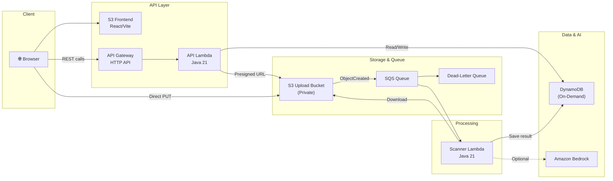

# LogScan

A serverless log threat detection web application. Upload log files through a browser, automatically scan them for security threats using keyword-based or AI-powered analysis, and view detailed findings — all running on AWS with zero servers to manage.

---

## Live Demo

| Resource | URL |
|----------|-----|
| Frontend | [http://log-scanner.cloudival.com](http://log-scanner.cloudival.com) |
| API Health | [https://tl91ipqj7a.execute-api.ap-southeast-1.amazonaws.com/api/health](https://tl91ipqj7a.execute-api.ap-southeast-1.amazonaws.com/api/health) |

> The demo uses HTTP because CloudFront is currently blocked by AWS account verification. The application is fully functional over HTTP with S3 static website hosting and Route 53.

---

## Architecture



**Request flow:**

1. User selects a log file in the browser.
2. Frontend calls `POST /api/files` — API Lambda validates, creates a DynamoDB record, returns a presigned S3 PUT URL.
3. Browser uploads the file directly to S3 using the presigned URL.
4. Frontend calls `POST /api/files/{fileId}/confirm` — status transitions to `PENDING`.
5. S3 emits an `ObjectCreated` event to SQS.
6. Scanner Lambda processes the SQS message, downloads the file, runs threat analysis, and writes results to DynamoDB.
7. User views scan results on the frontend.

---

## Why Serverless

- Zero cost at idle — pay only for actual usage.
- No servers, containers, or clusters to manage, patch, or scale.
- Automatic scaling from zero to thousands of concurrent scans.
- Simplified deployment — `terraform apply` provisions everything.
- Ideal for hackathon demos where uptime cost matters.

## Why DynamoDB Instead of RDS

- No VPC, NAT Gateway, or connection pooling required.
- Zero cost when idle (PAY_PER_REQUEST billing).
- Simple key-value access pattern (`ownerUserId` + `fileId`).
- Serverless-native — scales automatically alongside Lambda.
- No database server lifecycle management.

---

## Features

- Upload log files from the browser with drag-and-drop.
- Presigned S3 PUT URLs — file bytes never pass through Lambda.
- Asynchronous scanning via SQS decoupling.
- Keyword-based threat detection with line-level findings.
- Clean/threat result views with severity levels (NONE → CRITICAL).
- Dark security-dashboard UI with glassmorphism design.
- Terraform infrastructure-as-code for reproducible deployments.
- Optional Amazon Bedrock integration for AI-powered analysis.
- Optional Amazon Cognito for authenticated multi-user isolation.

---

## Threat Detection Modes

### MOCK Mode (Default)

Keyword-based detector that scans line-by-line for patterns like:

`unauthorized access`, `sql injection`, `brute force`, `malware detected`, `privilege escalation`, `failed login`, `suspicious command`, `rm -rf`, `chmod 777`, `root login`

Threat level is determined by the number of distinct keywords found:

| Distinct Keywords | Threat Level |
|-------------------|-------------|
| 0 | NONE |
| 1 | LOW |
| 2 | MEDIUM |
| 3–4 | HIGH |
| 5+ | CRITICAL |

No external service dependencies. Works immediately after deployment.

### BEDROCK Mode (Optional, Disabled)

AI-powered analysis using Amazon Bedrock (Claude). Requires model access approval in the AWS account. Enable with:

```hcl
detector_type = "BEDROCK"
```

---

## Authentication and File Ownership

**Current demo mode:** Anonymous. All uploads are scoped to `ownerUserId = "anonymous"`. This is suitable for demonstration but does not provide per-user file isolation.

**Cognito-ready design:** The application supports Amazon Cognito authentication with Authorization Code + PKCE flow. When enabled:

- Each user gets a unique `ownerUserId` from their Cognito JWT `sub` claim.
- File list, upload, and result APIs are scoped per user.
- Frontend shows login/logout controls and protects routes.

Per-user isolation requires:

```hcl
enable_cognito = true
# Also requires HTTPS (CloudFront) for Cognito callback URLs
```

---

## AWS Account Limitations

| Limitation | Impact | Workaround |
|-----------|--------|-----------|
| CloudFront not available | Frontend served over HTTP only | S3 website hosting + Route 53 A alias |
| Bedrock model access not approved | AI detector unavailable | MOCK keyword detector used instead |
| Cognito requires HTTPS callbacks | Auth disabled | Anonymous mode; Cognito infrastructure is ready |

Default feature flags:

```hcl
enable_cloudfront = false
enable_cognito    = false
detector_type     = "MOCK"
```

---

## Tech Stack

| Layer | Technology |
|-------|-----------|
| Frontend | React 18, Vite 5, React Router 6, CSS |
| API | Amazon API Gateway HTTP API (payload v2) |
| Compute | AWS Lambda (Java 21) |
| Storage | Amazon S3 (private upload + public frontend) |
| Queue | Amazon SQS (standard queue + DLQ) |
| Database | Amazon DynamoDB (on-demand) |
| DNS | Amazon Route 53 |
| IaC | Terraform (~> 5.0) |
| Testing | Vitest, React Testing Library, JUnit 5 |

---

## Project Structure

```
logscan/
├── frontend/                      # React + Vite frontend
│   ├── src/
│   │   ├── App.jsx               # Router, layout, auth integration
│   │   ├── auth.js               # Optional Cognito PKCE helper
│   │   ├── styles.css            # Global styles (glassmorphism theme)
│   │   ├── api/fileApi.js        # API client
│   │   ├── components/
│   │   │   ├── FileUpload.jsx    # Drag-drop upload with progress
│   │   │   ├── FileList.jsx      # File list with status badges
│   │   │   └── ScanResultDetail.jsx  # Threat findings display
│   │   └── test/                 # Vitest tests
│   ├── index.html
│   ├── vite.config.js
│   └── package.json
├── lambda/                        # Java 21 Lambda functions
│   ├── src/main/java/com/logscan/lambda/
│   │   ├── ApiHandler.java       # API Gateway handler (5 routes)
│   │   ├── ThreatDetectionHandler.java  # SQS-triggered scanner
│   │   ├── detector/
│   │   │   ├── ThreatDetector.java      # Interface
│   │   │   ├── MockThreatDetector.java  # Keyword-based (default)
│   │   │   └── BedrockThreatDetector.java  # AI-powered (optional)
│   │   └── model/ScanResult.java
│   ├── src/test/                  # JUnit 5 tests
│   └── pom.xml
├── infra/terraform/               # Terraform IaC
│   ├── versions.tf               # Provider configuration
│   ├── variables.tf              # All configurable variables
│   ├── main.tf                   # Resource definitions
│   ├── outputs.tf                # Deployment outputs
│   ├── deploy.sh                 # One-command deployment
│   ├── terraform.tfvars.example  # Template for local config
│   └── README.md                 # Terraform-specific docs
├── .gitignore
└── README.md                     # This file
```

---

## Local Development

### Frontend

```bash
cd frontend
npm install
npm run dev          # Start dev server at http://localhost:5173
npm test -- --run    # Run tests (25 tests)
npm run build        # Production build to dist/
```

### Lambda

```bash
cd lambda
mvn compile          # Compile
mvn test             # Run tests (22 tests)
mvn clean package -DskipTests   # Build uber-JAR
```

### Terraform

```bash
cd infra/terraform
terraform fmt -check -recursive
terraform validate
```

---

## Deployment

### Prerequisites

- Terraform >= 1.5
- AWS CLI configured with credentials
- Java 21 + Maven
- Node.js 18+ and npm

### Steps

```bash
cd infra/terraform

# 1. Configure
cp terraform.tfvars.example terraform.tfvars
# Edit terraform.tfvars:
#   upload_bucket_name  = "your-globally-unique-bucket-name"
#   frontend_domain     = "your-domain.example.com"
#   route53_zone_id     = "YOUR_ZONE_ID"

# 2. Deploy everything
./deploy.sh
```

The deploy script will:
1. Check prerequisites (`terraform`, `aws`, `npm`, `mvn`).
2. Build the Lambda JAR.
3. Run `terraform init` and `terraform apply`.
4. Build the frontend with injected API URL.
5. Upload frontend to S3.
6. Print the live URLs.

---

## Verification

After deployment:

```bash
# API health check
curl https://YOUR-API-ID.execute-api.ap-southeast-1.amazonaws.com/api/health
# Expected: {"status":"UP"}

# Frontend check
curl -I http://your-domain.example.com
# Expected: HTTP/1.1 200 OK, Server: AmazonS3

# CORS preflight
curl -i -X OPTIONS "https://YOUR-API-ID.execute-api.ap-southeast-1.amazonaws.com/api/files" \
  -H "Origin: http://your-domain.example.com" \
  -H "Access-Control-Request-Method: POST" \
  -H "Access-Control-Request-Headers: content-type"
# Expected: access-control-allow-origin header present
```

### End-to-End Test

1. Open the frontend in a browser.
2. Upload a clean log file (e.g., `INFO app started` lines) → expect threat level **NONE**.
3. Upload a malicious log file containing keywords like `SQL injection`, `brute force`, `failed login` → expect threat level **HIGH** or **CRITICAL**.
4. View scan results with line-level findings.

---

## Security Notes

- **Upload bucket** is fully private — all public access is blocked. Browser uploads use presigned PUT URLs that expire in 15 minutes.
- **Frontend bucket** is public only for S3 static website hosting (serves HTML/JS/CSS). When CloudFront is enabled, the bucket becomes private behind OAC.
- **DynamoDB** has server-side encryption enabled.
- **Lambda IAM roles** follow least-privilege principle — each function only gets the permissions it needs.
- **Terraform state and tfvars** are excluded from git via `.gitignore`. Never commit credentials or state files.
- **CORS** is restricted to the configured frontend domain and `localhost:5173`.

---

## Future Improvements

- [ ] Enable CloudFront + HTTPS after AWS account verification.
- [ ] Enable Cognito login for per-user file isolation.
- [ ] Enable Bedrock AI detector after model access approval.
- [ ] Add CloudWatch dashboards, metrics, and alarms.
- [ ] Add S3 lifecycle rules to expire old uploads.
- [ ] Add DynamoDB TTL for automatic scan data cleanup.
- [ ] Add pagination to the file list API.
- [ ] Add auto-refresh polling on the file list while scans are pending.

---

## License

Built for the AWS Hackathon.
