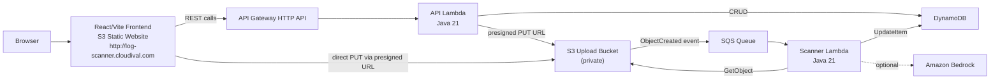

# LogScan

Serverless log threat detection web application. Users upload log files through a React frontend, files are stored privately in S3, S3 events trigger asynchronous scanning through SQS and Lambda, and scan results are stored in DynamoDB.

## Architecture



## Why DynamoDB (Not RDS)

- Zero cost at rest with PAY_PER_REQUEST billing.
- No VPC, NAT Gateway, or connection pooling needed.
- Simple key-value access pattern (ownerUserId + fileId).
- Serverless-native: scales automatically with Lambda.
- No database server to manage, patch, or pay for when idle.

## Authentication & File Ownership

- Every file is scoped by `ownerUserId` (DynamoDB partition key).
- When Cognito is enabled: `ownerUserId` = Cognito JWT `sub` claim. Each user sees only their own files.
- When Cognito is disabled (default): `ownerUserId` = `"anonymous"`. All users share the same view — there is no per-user isolation in anonymous mode.
- Per-user file isolation only works when Cognito is enabled (`enable_cognito = true`).
- The React frontend automatically shows login/logout controls and protects views when Cognito env vars are configured.

## AWS Account Limitations

The default deployment assumes:

- **CloudFront** may be blocked until account verification — disabled by default.
- **Bedrock** may be blocked until model access approval — uses MOCK detector by default.
- **Cognito** is optional — disabled by default for HTTP-only frontend.

### Default Feature Flags

```hcl
enable_cloudfront = false
enable_cognito    = false
detector_type     = "MOCK"
```

## Tech Stack

| Layer | Technology |
|-------|-----------|
| Frontend | React 18, Vite 5, React Router 6 |
| API | Amazon API Gateway HTTP API |
| Compute | AWS Lambda (Java 21) |
| Storage | Amazon S3 |
| Queue | Amazon SQS + DLQ |
| Database | Amazon DynamoDB (on-demand) |
| IaC | Terraform |
| Domain | Route 53 + S3 website hosting |

## Project Structure

```text
frontend/          React + Vite frontend
lambda/            Java 21 Lambda functions (API + Scanner)
infra/terraform/   Terraform infrastructure as code
```

## Deploy

```bash
cd infra/terraform
cp terraform.tfvars.example terraform.tfvars
# Edit terraform.tfvars with your values
./deploy.sh
```

## API Endpoints

| Method | Route | Description |
|--------|-------|-------------|
| GET | `/api/health` | Health check |
| POST | `/api/files` | Create file metadata + get presigned upload URL |
| POST | `/api/files/{fileId}/confirm` | Confirm upload → trigger scan |
| GET | `/api/files` | List files for current owner |
| GET | `/api/files/{fileId}/result` | Get scan result |

## Running Tests

### Frontend

```bash
cd frontend
npm test -- --run
```

### Lambda

```bash
cd lambda
mvn test
```

### Terraform

```bash
cd infra/terraform
terraform fmt -check
terraform validate
```

## Secret Safety

Never commit:
- `terraform.tfvars` (contains bucket names, zone IDs)
- `.env` files
- Terraform state files
- AWS credentials
- Private keys

All are covered by `.gitignore`.

## Frontend URL

Default (HTTP, S3 website hosting via Route 53):

```
http://log-scanner.cloudival.com
```

HTTPS requires enabling CloudFront with an ACM certificate.
